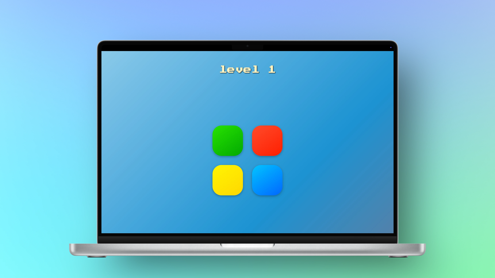

# Simon Game

A **recreated classic Simon memory game** built with **HTML, CSS, JavaScript, and jQuery**, where players must **repeat increasingly long sequences** of colored buttons with **visual and audio feedback**.

<p align="center">
  
</p>

<br>

---

## Project Overview

**Simon Game** is a browser-based memory challenge demonstrating **DOM manipulation**, **event handling**, and **game logic** using **JavaScript and jQuery**. It highlights interactivity, user engagement, and pattern recognition in a clean, minimal interface.

This project demonstrates:

- Generating random sequences for the player to follow
- Tracking user input and validating correctness
- Visual and audio feedback on button presses
- Keyboard and mouse interaction handling
- Structuring a small front-end game with modular, maintainable code

<br>

---

## Live Demo

Try the game online here:  
[Play Simon Game on GitHub Pages]()

<br>

---

## How to Play

1. Press **any key** to start the game.
2. Watch the sequence of colors light up.
3. Repeat the sequence by clicking the buttons in the correct order.
4. The sequence gets longer each round—see how far you can go!
5. Game ends when a wrong button is pressed.
6. Reach level 5 to win the game.

<br>

---

## Requirements

Before running this project locally, ensure you have:

- A modern web browser (`Chrome`, `Firefox`, `Safari`, `Edge`)
- No backend or additional dependencies required

<br>

---

## Installation & Setup

1. Clone the repository:
   ```bash
   git clone https://github.com/MustafaHabibX/simon-game.git
   ```
2. Navigate into the project folder:
   ```bash
   cd simon-game
   ```
3. Open `index.html` in your web browser.

(Optional: Use **VS Code** or any IDE to preview and modify the project.)

<br>

---

## Key Features

- Generate and display randomized color sequences
- Track user input and check correctness
- Visual and audio feedback for each button press
- Keyboard and mouse controls for starting and playing
- Dynamic title updates to show level, win, or game over
- Clean, responsive layout for all screen sizes

<br>

---

## Technologies

- **HTML5** – Structure of the web app
- **CSS3** – Styling and animations
- **JavaScript (ES6)** – Core game logic and functionality
- **jQuery** – DOM selection and event handling
- **GitHub Pages** – Hosting live demo

<br>

---

## Learning Outcomes

By completing this project, you gain hands-on experience in:

- Implementing game logic and sequence generation
- Using **jQuery** for interactive web elements
- Handling user input and validating responses
- Creating audio-visual feedback in a browser game
- Writing clean, modular, and maintainable JavaScript
- Building a portfolio-ready front-end project

<br>
